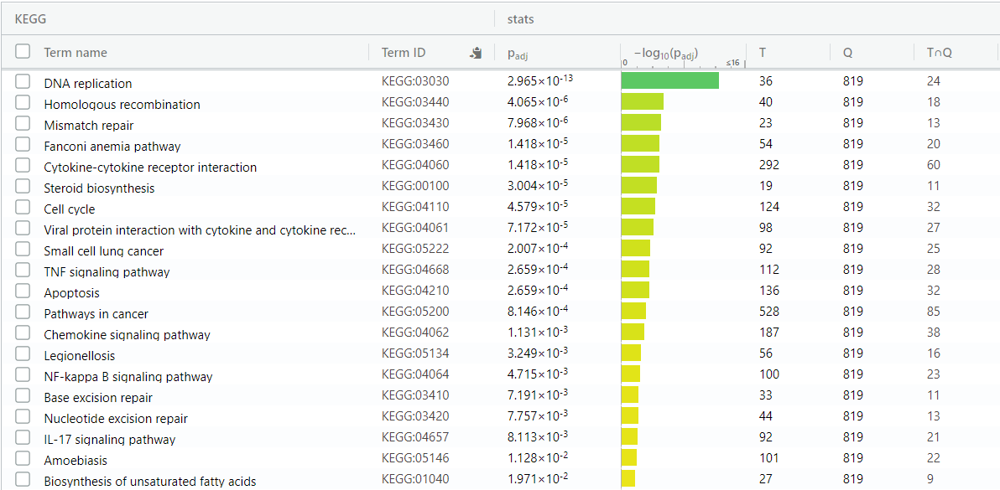
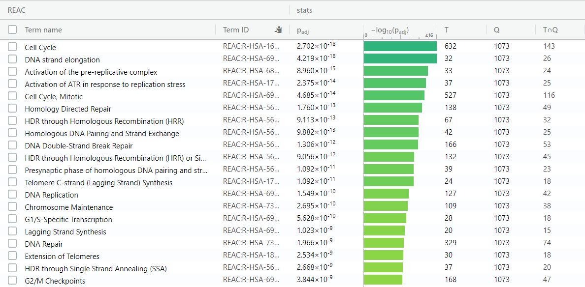
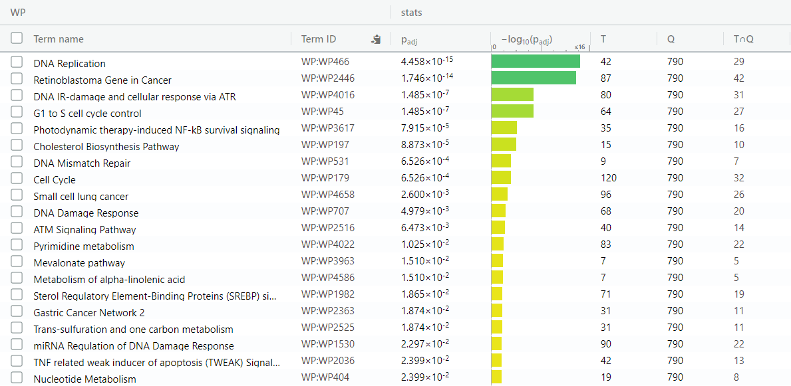
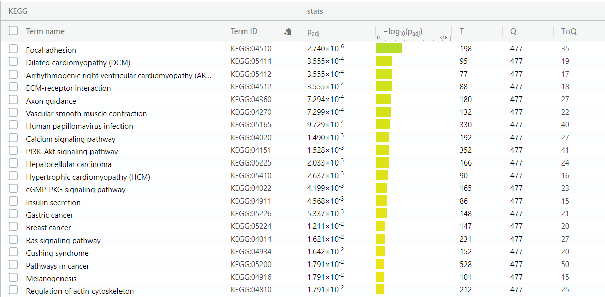
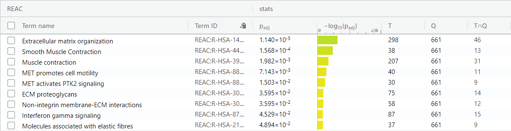
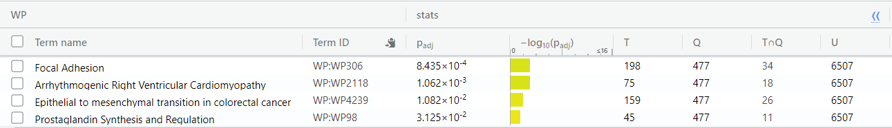
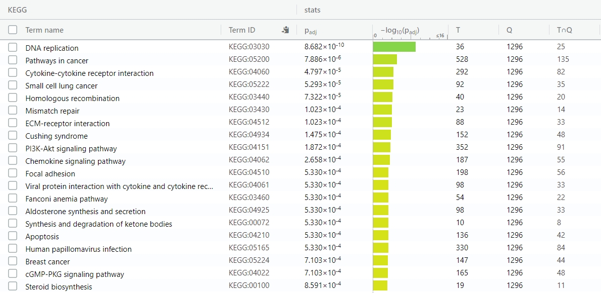
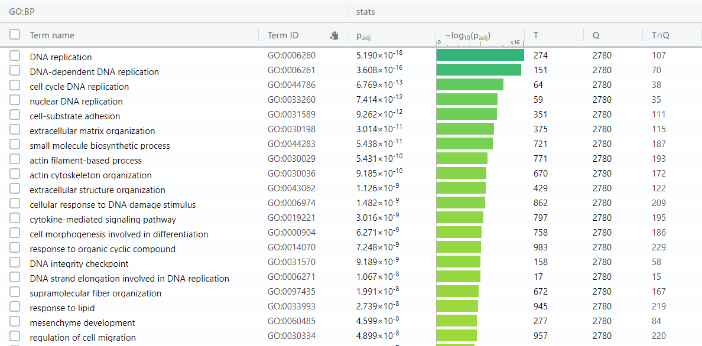

# Introduction
This notebook calls the notebook for Assignment 1 as a child document, in order
to run the necessary code to create my dataframe of normalized gene expression
values. Since the Assignment 1 notebook is run, all text in this document is knit
to HTML when the Assignment 2 notebook is compiled. This text is given in the section
below. **To skip this and go to the actual work for Assignment 2, use the table of
contents to go to the "Introduction to Assignment 2" section of this document.**
Also note that this notebook (for Assignment 2) must be compiled in the same 
directory as my Assignment 1 notebook in order to compile properly. Some of the
figures in this notebook are placed in the "Assignment_2_Figures" directory on
my GitHub repository. This figure directory must be placed in the same directory
as this R notebook in order for the notebook to compile properly.

# Assignment 1 (full text)

```{r child='420_Assignment_1.Rmd', include=FALSE, eval=TRUE}
```


# Introduction to Assignment 2


# Initial setup


```{r message=FALSE, warning=FALSE, error=FALSE, results='hide'}
if (!requireNamespace("BiocManager", quietly = TRUE))
    install.packages("BiocManager")

if (!requireNamespace("limma", quietly = TRUE))
    BiocManager::install("limma")

if (!requireNamespace("ComplexHeatmap", quietly = TRUE))
    BiocManager::install("ComplexHeatmap")

```


# Differential expression analysis


Filter expression data to only contain the 6 replicates of interest
```{r}
replicateNames <- colnames(logCPMNormalizedExpressionData)[grepl(
            "UI_UT", colnames(logCPMNormalizedExpressionData)) | grepl(
            "RH_UT", colnames(logCPMNormalizedExpressionData))]
expressionData <- logCPMNormalizedExpressionData[ , replicateNames]

```


Here's what the dataset now looks like:
```{r}
head(expressionData)
```


MDS plot of data:
```{r}
limma::plotMDS(expressionData, col = rep(c("lightcoral", "lightblue"), each = 3), 
               main = "After log-CPM and TMM normalization")
```


Create model for differential expression (based on code from Lecture 5). 
First, classify the infection status and sequencing batch of each of the 6 replicates:
```{r}
replicateLabels <- data.frame(Infection = rep(c("Uninfected", "Infected"), each = 3), 
                              Batch = rep(c("A", "B", "C"), times = 2))
rownames(replicateLabels) <- colnames(expressionData)

# Make infection status an ordered factor with "Uninfected" first so that Uninfected
# expression data is the baseline for differential-expression analysis (otherwise
# Infected will be treated as the baseline)
replicateLabels$Infection <- factor(replicateLabels$Infection, levels = c("Uninfected", "Infected"))

replicateLabels
```


Create the model using model.matrix:
```{r}
expression_model <- model.matrix(~ replicateLabels$Infection + replicateLabels$Batch)

expression_model
```

The first 3 replicates (i.e. the uninfected ones) have their infection status in
the second column set to 0, so the uninfected data should be treated as the control
in differential-expression analyses


Fit data to the model and calculate differential expression. For topTable we 
set the "coef" parameter to 2, since in our model object (expression_model), 
expression status is represented in the second column:
```{r}
model_fit <- limma::lmFit(expressionData, expression_model)
bayes_model_fit <- limma::eBayes(model_fit, trend = TRUE)
differential_expression_results <- limma::topTable(bayes_model_fit, coef = 2, 
                          adjust.method = "BH", number = nrow(expressionData))
```

Here's what the resulting table looks like:
```{r}
head(differential_expression_results)
```

Without any correction for multiple testing, how many genes had a p-value of at
most 0.05?
```{r}
sum(differential_expression_results$P.Value <= 0.05)
```

After correcting for multiple-testing, how many genes have an adjucted p-value of
at most 0.05?
```{r}
sum(differential_expression_results$adj.P.Val <= 0.05)
```

What proportion of genes is this?
```{r}
sum(differential_expression_results$adj.P.Val <= 0.05) / nrow(expressionData)
```

This is kind of a lot (almost 60%) - what if we restrict this to just genes
with a magnitude of log-fold change of at least 1?
```{r}
sum(differential_expression_results$adj.P.Val <= 0.05 & 
      abs(differential_expression_results$logFC) >= 1)
```

What proportion of genes is this?
```{r}
sum(differential_expression_results$adj.P.Val <= 0.05 & 
      abs(differential_expression_results$logFC) >= 1) / nrow(expressionData)
```


MA plot of the results, with colors to indicate significantly-differentially
expressed genes (log-fold change of at least 2 and adjusted p-value of at most
0.05):
```{r}
# Reorder the dataframe of log-fold changes and p-values so that the rows match
# the original dataset
differential_expression_results <- differential_expression_results[rownames(expressionData), ]

differential_expression_status <- apply(differential_expression_results, 1, function(gene) {
  if (gene["logFC"] <= 0 && gene["adj.P.Val"] <= 0.05) {
    return("Downregulated genes")
  } else if (gene["logFC"] >= 0 && gene["adj.P.Val"] <= 0.05) {
    return("Upregulated genes")
  } else {
    return("Not differentially expressed")
  }
})


limma::plotMD(bayes_model_fit, column = 2, status = differential_expression_status, 
              cex = 0.5, main = "Differential gene expression between infected and uninfected cells")
```


Subset my initial set of 14,813 genes into 3 different groups: those that are 
significantly upregulated, those that are significantly downregulated, and 
those that are significantly differentially-expressed (either up or down). Here, 
significant differences have an adjusted p-value of at least 0.05 and a magnitude 
of log-fold change of at least 1
```{r}
up_genes <- rownames(differential_expression_results)[differential_expression_results$logFC >= 1 
                            & differential_expression_results$adj.P.Val <= 0.05]
up_genes <- expressionData[up_genes, ]

down_genes <- rownames(differential_expression_results)[differential_expression_results$logFC <= -1 
                            & differential_expression_results$adj.P.Val <= 0.05]
down_genes <- expressionData[down_genes, ]

diff_genes <- rbind(up_genes, down_genes)
```

How many genes are significantly upregulated and pass my thresholds?
```{r}
nrow(up_genes)
```

How many genes are significantly downregulated and pass my thresholds?
```{r}
nrow(down_genes)
```

Here are the expression values for the 10 most significant genes that are 
overexpressed in infected cells (using a log-fold change cutoff of 1):
```{r}
sorted_differential_expression_results <- differential_expression_results[order(
                   differential_expression_results$adj.P.Val, decreasing = F), ]
most_significant_up_genes <- rownames(sorted_differential_expression_results[
                    sorted_differential_expression_results$logFC >= 1, ])[1:10]
expressionData[most_significant_up_genes, ]
```

Here are the expression values for the 10 most significant genes that are 
underexpressed in infected cells (using a log-fold change cutoff of -1):
```{r}
most_significant_down_genes <- rownames(sorted_differential_expression_results[
                    sorted_differential_expression_results$logFC <= -1, ])[1:10]
expressionData[most_significant_down_genes, ]
```

Heatmap of just the differentially-expressed genes:
```{r}
ComplexHeatmap::Heatmap(t(scale(t(diff_genes))), show_row_names = FALSE, 
                        column_title = "All differentially-expressed genes", 
                        name = "Normalized gene expression")
```

Heatmap of just the genes that are upregulated in infected cells:
```{r}
ComplexHeatmap::Heatmap(t(scale(t(up_genes))), show_row_names = FALSE, 
                        column_title = "Genes upregulated in infected cells", 
                        name = "Normalized gene expression")
```

Heatmap of just the genes that are downregulated in infected cells:
```{r}
ComplexHeatmap::Heatmap(t(scale(t(down_genes))), show_row_names = FALSE, 
                        column_title = "Genes downregulated in infected cells", 
                        name = "Normalized gene expression")
```


# Overrepresentation analysis


Save all 3 sets of differentially-expressed genes as text files that can be uploaded
to g:Profiler
```{r}
write.table(rownames(up_genes), file = "up_genes.txt", quote = F, row.names = F, col.names = F)
write.table(rownames(down_genes), file = "down_genes.txt", quote = F, row.names = F, col.names = F)
write.table(rownames(diff_genes), file = "diff_genes.txt", quote = F, row.names = F, col.names = F)
```

Run g:Profiler using the web interface (https://biit.cs.ut.ee/gprofiler/gost).
Set organism to "Homo sapiens", use a significance threshold of 0.05 using 
Benjamini-Hochberg FDR. Data sources are GO biological process, KEGG, Reactome, 
and WikiPathways. For genes with mulitple Ensembl IDs, select the gene with the
most GO annotations. No cutoff on the size of the returned genesets.

The versions of these 4 annotation sets are as follows (this information comes
from g:Profiler's "Data sources" tab):
**GO biological process** – releases/2019-07-01
**KEGG** – KEGG FTP Release 2019-09-30
**Reactome** – annotations: ensembl classes: 2019-10-2
**WikiPathways** – 20190910


Upregulated genes in infected cells:


In total, the genes upregulated in infected cells were enriched for 804 GO
biological process terms, 30 KEGG terms, 131 Reactome terms, and 26 WikiPathway
terms.


Top 20 GO biological process terms in upregulated genes:


Top 20 KEGG terms in upregulated genes:


Top 20 Reactome terms in upregulated genes:


Top 20 WikiPathways terms in upregulated genes:



Downregulated genes in infected cells:


In total, the genes downregulated in infected cells were enriched for 410 GO
biological process terms, 30 KEGG terms, 9 Reactome terms, and 4 WikiPathway
terms.

Top 20 GO biological process terms in downregulated genes:


Top 20 KEGG terms in downregulated genes:


All 9 Reactome terms in downregulated genes:


All 4 WikiPathways terms in downregulated genes:



All differentially-expressed genes in infected cells (both upregulated and 
downregulated):


In total, the genes that are differentially-expressed in infected cells were enriched for 1012 GO
biological process terms, 51 KEGG terms, 120 Reactome terms, and 15 WikiPathway
terms.

Top 20 GO biological process terms in differentially-expressed genes:


Top 20 KEGG terms in differentially-expressed genes:


Top 20 Reactome terms in differentially-expressed genes:


All 15 WikiPathways terms in differentially-expressed genes:


Many of the most significant GO biological process terms enriched among the set
of all differentially-expressed genes are very general and contain thousands of
different genes. To get a look at the more specific GO biological process terms 
enriched among these genes, I restricted the returned genesets to only those
that contained at most 1000 genes. Doing so reduced the total number of enriched
GO BP terms from 1012 to 820. The 20 most significant of these 820 terms are shown
below:



# Interpretation

FIGURE FROM Immunological Molecular Responses of Human Retinal Pigment Epithelial Cells to Infection With Toxoplasma gondii


# References
