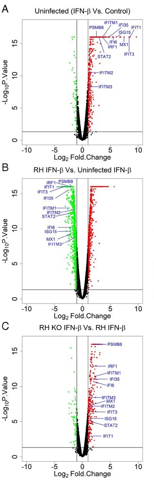
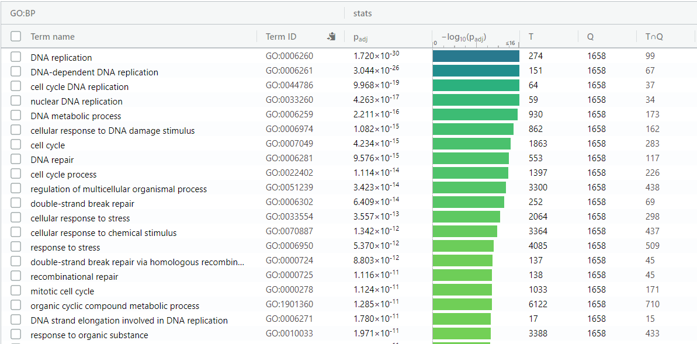
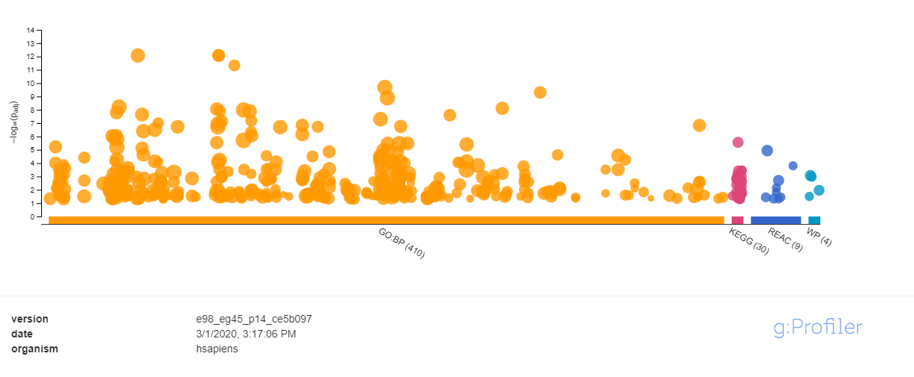
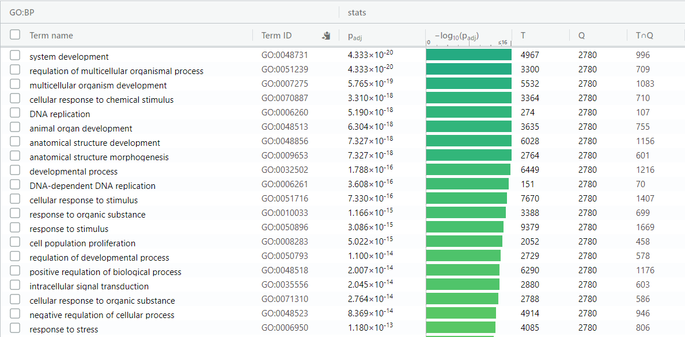
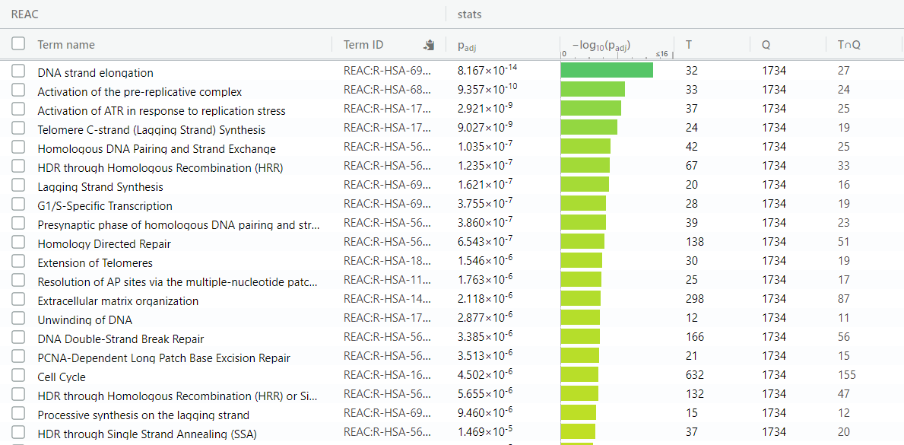
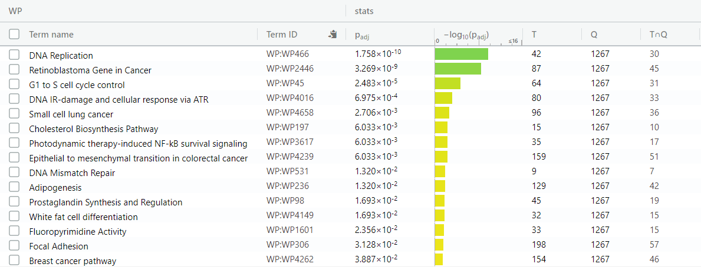
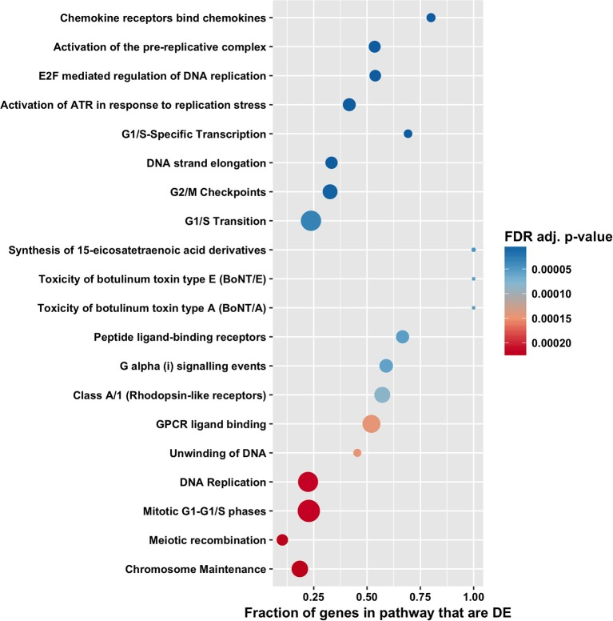

# About this notebook
This notebook calls the notebook for Assignment 1 as a child document, in order
to run the necessary code to create my dataframe of normalized gene expression
values. Since the Assignment 1 notebook is run, all text in this document is knit
to HTML when the Assignment 2 notebook is compiled. This text is given in the section
below. **To skip this Assignment 1 text and go to the actual work for Assignment 2, use the table of
contents to go to the "Introduction to Assignment 2" section of this document.**
Also note that this notebook (for Assignment 2) must be compiled in the same 
directory as my Assignment 1 notebook in order to compile properly. Some of the
figures in this notebook are placed in the "Assignment_2_Figures" directory on
my GitHub repository. This figure directory must be placed in the same directory
as this R notebook in order for the notebook to compile properly. Finally, this
notebook must be compiled in the same directory as the "420_Assignment_2.bib"
file on my GitHub repository. Answers to questions given in the assignment are
distributed throughout the notebook and are indicated in **bold**.

# Assignment 1 (full text)

```{r child='420_Assignment_1.Rmd', include=FALSE, eval=TRUE}
```


# Introduction to Assignment 2

The goal of this project is to determine which genes are differentially-expressed
in human cells infected with the intracellular parasite *Toxoplasma gondii*, and 
to look for any biological patterns in these differentially-expressed genes. To
do this, I am using a gene expression dataset from the 2019 paper 
"*Toxoplasma gondii* effector TgIST blocks type I interferon signaling to promote 
infection" [@matta2019toxoplasma], which can be found 
at [this URL.](https://www.pnas.org/content/116/35/17480) 
In this study, human foreskin fibroblast (HFF) cells were either left uninfected, 
infected with wild-type *T. gondii* (from the RH strain), or infected with knockout *T. gondii*
missing a gene encoding a protein called TgIST that the parasite secretes during host infection.
For each of these 3 infection conditions, the authors additionally treated HFF cells with 
the signaling molecule IFN-B, which is involved in the response of host cells to
infection, or left them untreated. So, there is 1 control condition (uninfected & untreated) and 5 different experimental
conditions (uninfected & IFN-B-treated, wild-type infected & untreated, wild-type
infected & IFN-B-treated, knockout-infected & untreated, and knockout-infected &
IFN-B-treated). RNA-seq data was collected from each of these 6 experimental
conditions in triplicate, for a total of 18 different RNA-seq replicates. This
RNA-seq data is deposited in GEO at accession number
GSE125066, which can be found at [this URL.](https://www.ncbi.nlm.nih.gov/geo/query/acc.cgi?acc=GSE125066)

The authors' major findings with regard to gene expression are shown in the volcano plots
below, which come from Figure 2 of their paper [@matta2019toxoplasma].The genes indicated 
in blue are signaling genes used to activate host defenses against infection. 
This study found that these genes are activated by IFN-B (panel A), but repressed in 
IFN-B-treated cells that are also infected
with wild-type *T. gondii* (panel B), suggesting that *T. gondii* alters host gene expression for its own
benefit. The authors determined that TgIST plays a role in this
host manipulation, as infection with knockout parasites missing this gene still results in
the IFN-B-mediated upregulation of these signaling genes, as seen in uninfected cells
(panel C). 



While the comparisons done in this study all involve IFN-B-treated cells, my 
comparison here will be between untreated cells. So, my control condition is 
uninfected HFF cells untreated with IFN-B, and my experimental condition is 
wild-type *T. gondii*-infected HFF cells untreated with IFN-B.

In Assignment 1, I downloaded the raw gene expression data for these 18 replicates off of GEO, 
filtered out lowly-expressed genes (those without at least 1 Count Per Million
in at least 3 different replicates), and mapped their Ensembl IDs onto HUGO gene symbols.
Doing so reduced my initial dataset of 57,773 genes down to 14,813 genes with
unique HUGO symbols. I then normalized this raw data to log2-Counts Per Million 
(CPM) using Trimmed Mean of M-values (TMM) normalization, to account for technical
variation between samples. Doing so produced a dataframe of log2-CPM normalized
gene expression values with 14,813 rows (one for each gene) and 18 columns (one
for each replicate). Each of these rows is named after a unique HUGO gene symbol.
I can now use this gene expression data to detect genes that
are differentially-expressed between uninfected, untreated HFF cells and wild-type
infected, untreated HFF cells.


# Initial setup

Before I continue with my analysis pipeline, I need to make sure that all of the
packages I need are properly loaded. The code here checks to see if the packages 
I need are properly installed, and installs them if necessary. The packages I use
in this notebook are BiocManager [@BiocManager], limma [@limma], and ComplexHeatmap
[@ComplexHeatmap]. While they're not explicitly used in this notebook, I also make
use of several packages during Assignment 1 (which is sourced to generate the
gene expression data here), namely GEOquery [@GEOquery], edgeR [@edgeR], biomaRt
[@biomaRt], and ggplot2 [@ggplot2].
```{r message=FALSE, warning=FALSE, error=FALSE, results='hide'}
if (!requireNamespace("BiocManager", quietly = TRUE))
    install.packages("BiocManager")

if (!requireNamespace("limma", quietly = TRUE))
    BiocManager::install("limma")

if (!requireNamespace("ComplexHeatmap", quietly = TRUE))
    BiocManager::install("ComplexHeatmap")

```


# Differential expression analysis
Right now, my dataframe of gene expression values contains one column for each of
the 18 replicates in the original study. I'm only interested in 2 of the 6 experimental
groups from this study, so I only need 6 of the 18 replicates. The code here filters
my dataframe from Assignment 1 to keep only the data from uninfected, untreated cells
and wild-type infected, untreated cells.
```{r}
replicateNames <- colnames(logCPMNormalizedExpressionData)[grepl(
            "UI_UT", colnames(logCPMNormalizedExpressionData)) | grepl(
            "RH_UT", colnames(logCPMNormalizedExpressionData))]
expressionData <- logCPMNormalizedExpressionData[ , replicateNames]

```

Here's what the dataset now looks like - the "UI_UT" columns are the 3 uninfected
replicates, and the "RH_UT" columns are the 3 infected replicates:
```{r}
head(expressionData)
```

In order to perform differential gene expression, I need to define a model to fit
my data to. To figure out a good model design, I can make an MDS plot of these 6
replicates to see how different replicates cluster together:
```{r}
limma::plotMDS(expressionData, col = rep(c("lightcoral", "lightblue"), each = 3), 
               main = "Log-CPM and TMM normalized data")

# Add in a plot legend since plotMDS doesn't include one
legend("topleft", legend = c("Uninfected", "Infected"), fill = c("lightcoral", 
                                                                 "lightblue"))
```

The uninfected and infected replicates are clearly separated from each other, so
infection status has a significant effect on gene expression similarity. Also, the
replicates appear to separate out along the y-axis by the batch they were sequenced
in (either "A", "B", or "C"). So, my model should take into account
differences in both infection status and sequencing batch, so I can look for 
differences due to infection while controlling for differences due to sequencing batch.

To detect differentially-expressed genes, I'm going to use limma [@limma]. The
first step is to define a model to use for differential expression. Here, I make
an object to classify the infection status and sequencing batch of each of the 
6 replicates, since I want my model to include both infection and batch information.
This code is based off of code shown in Lecture 5:
```{r}
replicateLabels <- data.frame(Infection = rep(c("Uninfected", "Infected"), each = 3), 
                              Batch = rep(c("A", "B", "C"), times = 2))
rownames(replicateLabels) <- colnames(expressionData)

# Make infection status an ordered factor with "Uninfected" first so that Uninfected
# expression data is the baseline for differential-expression analysis (otherwise
# Infected will be treated as the baseline)
replicateLabels$Infection <- factor(replicateLabels$Infection, levels = c("Uninfected", "Infected"))

replicateLabels
```

I can now use these replicate labels to create a model using model.matrix():
```{r}
expression_model <- model.matrix(~ replicateLabels$Infection + replicateLabels$Batch)

expression_model
```

The first 3 replicates (i.e. the uninfected ones) have their infection status in
the second column set to 0, so the uninfected data should be treated as the control
in differential-expression analyses.

Now that I have a model, I can fit my data to the model and calculate differential expression
using limma [@limma]. Again, this code is based off of code shown in Lecture 5.
For the eBayes() function, I set "trend = TRUE" to indicate that this is RNA-seq and
not microarray data. For the topTable() function I set the "coef" parameter to 2, 
since in my model object (expression_model), expression status is represented in the second column
("replicateLabels$InfectionInfected").
```{r}
model_fit <- limma::lmFit(expressionData, expression_model)
bayes_model_fit <- limma::eBayes(model_fit, trend = TRUE)
differential_expression_results <- limma::topTable(bayes_model_fit, coef = 2, 
                          adjust.method = "BH", number = nrow(expressionData))
```

I now have an object that contains the results of differential-expression analysis
between wild-type *T. gondii*-infected HFF cells and uninfected HFF cells, 
for all 14,813 of my genes. Here's what the resulting object looks like:
```{r}
head(differential_expression_results)
```

For every gene, I have the log-fold change and average expression, along with p-values and
adjusted p-values. **I corrected p-values using 
Benjamini-Hochberg correction, since this method is commonly used to correct for
multiple hypothesis testing, and this was the correction method we used in class
and on the homework assignments.**

I now need to filter these genes to get only those that are significantly 
differentially-expressed. **For my significance threshold, I'm going to use a 
p-value of 0.05, again because this is a commonly-used statistical threshold, 
and the one that was used in class and on the homework assignments.**

Without any correction for multiple hypothesis testing (i.e. using non-adjusted p-values),
how many genes had a p-value of at most 0.05?
```{r}
sum(differential_expression_results$P.Value <= 0.05)
```

After correcting for multiple hypothesis testing using Benjamini-Hochberg correction,
how many genes have an adjusted p-value of at most 0.05?
```{r}
sum(differential_expression_results$adj.P.Val <= 0.05)
```

**So, using a p-value threshold of 0.05, there are 9523 significant genes using
normal p-values and 8810 significant genes using adjusted p-values**. Since
I do want to correct for multiple hypothesis testing, I'm only going to look at
these 8810 genes that pass my adjusted p-value cutoff. What proportion of 
my 14,813 genes is this?
```{r}
sum(differential_expression_results$adj.P.Val <= 0.05) / nrow(expressionData)
```

So, using an adjusted p-value cutoff of 0.05, almost 60% of the genes in my dataset
come out as significantly differentially-expressed. This is kind of a lot of genes, 
and I'm not sure how informative such a large group of genes is going to be. I can 
narrow down these results by applying an additional threshold on the magnitude of
expression differences, rather than just their statistical significance. **As an additional 
threshold, I'm only going to consider genes to be significantly differentially-expressed
if they have a magnitude of log-fold change of at least 1 (i.e. they at least double
or halve in expression between infected and uninfected cells).** I think it makes
sense to filter genes based on the magnitude of differences - the study I got this
data from [@matta2019toxoplasma] also filtered their differentially-expressed genes
using a log-fold change cutoff of 1, and I've seen this threshold used in many other
papers using RNA-seq data. This threshold should help me to narrow down my set of
genes to only my strongest and most biologically relevant hits.

Here's how many genes are significant using a non-adjusted p-value cutoff of 0.05
and a magnitude of log-fold change cutoff of at least 1:
```{r}
sum(differential_expression_results$P.Value <= 0.05 & 
      abs(differential_expression_results$logFC) >= 1)
```

And here's how many genes are significant using an adjusted p-value cutoff of 0.05
and a magnitude of log-fold change cutoff of at least 1:
```{r}
sum(differential_expression_results$adj.P.Val <= 0.05 & 
      abs(differential_expression_results$logFC) >= 1)
```

**So, using a significance threshold of 0.05 and a log-fold change cutoff of 
at least 1 (or below -1), there are 3603 differentially-expressed genes using non-adjusted 
p-values and 3546 differentially-expressed genes using adjusted p-values. For
my final set of differentially-expressed genes, I'm going to use the 3546 genes with
an adjusted p-value of at most 0.05 and a magnitude of log-fold change of at least
1.**

I then checked what proportion of my initial 14,813 genes are in this set of 
differentially-expressed genes:
```{r}
sum(differential_expression_results$adj.P.Val <= 0.05 & 
      abs(differential_expression_results$logFC) >= 1) / nrow(expressionData)
```

So, around 24% of my genes pass my statistical significance and log-fold change
thresholds.

To visualize the amount of differential expression in my set of 14.813 genes, I
made an MA plot using the results calculated by limma. On this plot, I 
color-coded my genes according to whether they were significantly
upregulated (adjusted p-value <= 0.05, log-fold change >= 1), 
significantly downregulated (adjusted p-value <= 0.05, log-fold change <= -1), or
not significantly different.
```{r}
# Reorder the dataframe of log-fold changes and p-values so that the rows match
# the original dataset
differential_expression_results <- differential_expression_results[rownames(expressionData), ]

# Classify the differential-expression status of each gene
differential_expression_status <- apply(differential_expression_results, 1, function(gene) {
  if (gene["logFC"] <= -1 && gene["adj.P.Val"] <= 0.05) {
    return("Downregulated genes")
  } else if (gene["logFC"] >= 1 && gene["adj.P.Val"] <= 0.05) {
    return("Upregulated genes")
  } else {
    return("Not differentially expressed")
  }
})

# Draw the resulting MA plot
limma::plotMD(bayes_model_fit, column = 2, status = differential_expression_status, 
              cex = 0.5, main = "Differential gene expression between infected and uninfected cells")
```

Based on this MA plot, it appears that I have more upregulated genes than downregulated genes, 
and that the highest log-fold changes are found among my upregulated genes.

Now that I have a list of differentially-expressed genes, I can define subsets of
these genes, based on the direction of change. The code here splits my dataframe
of log-CPM expression values into only the genes that are significantly upregulated, 
only the genes that are significantly downregulated, and the union of these sets
(i.e. the genes that are significantly different in either direction).
```{r}
up_genes <- rownames(differential_expression_results)[differential_expression_results$logFC >= 1 
                            & differential_expression_results$adj.P.Val <= 0.05]
up_genes <- expressionData[up_genes, ]

down_genes <- rownames(differential_expression_results)[differential_expression_results$logFC <= -1 
                            & differential_expression_results$adj.P.Val <= 0.05]
down_genes <- expressionData[down_genes, ]

diff_genes <- rbind(up_genes, down_genes)
```

I now have a set of upregulated genes (up_genes), a set of downregulated genes
(down_genes), and a set of both upregulated and downregulated genes (diff_genes).

How many genes are significantly upregulated and pass my thresholds?
```{r}
nrow(up_genes)
```

How many genes are significantly downregulated and pass my thresholds?
```{r}
nrow(down_genes)
```

**So, of my 3546 differentially-expressed genes, 2101 are significantly upregulated
in infected cells, and 1445 are significantly downregulated in infected cells**.

Here are the expression values for the 10 most significant genes that are 
overexpressed in infected cells (using a log-fold change cutoff of 1):
```{r}
sorted_differential_expression_results <- differential_expression_results[order(
                   differential_expression_results$adj.P.Val, decreasing = F), ]
most_significant_up_genes <- rownames(sorted_differential_expression_results[
                    sorted_differential_expression_results$logFC >= 1, ])[1:10]
expressionData[most_significant_up_genes, ]
```

And here are the expression values for the 10 most significant genes that are 
underexpressed in infected cells (using a log-fold change cutoff of -1):
```{r}
most_significant_down_genes <- rownames(sorted_differential_expression_results[
                    sorted_differential_expression_results$logFC <= -1, ])[1:10]
expressionData[most_significant_down_genes, ]
```

As expected, the upregulated genes have higher expression in infected ("RH") replicates
than uninfected ("UI") ones, whereas the downregulated genes have lower
expression in infected replicates.

In order to visualize the expression changes among all of my differentially-expressed
genes, I made heatmaps of log-CPM normalized gene expression values using 
ComplexHeatmap [@ComplexHeatmap]. I also applied row normaliztion using scale()
to each gene, to better visualize differences between replicates. These heatmaps
cluster rows and columns together on the basis of similar expression patterns.

Here's the heatmap of the expression values for all 3546 differentially-expressed genes
between infected and uninfected cells:
```{r}
ComplexHeatmap::Heatmap(t(scale(t(diff_genes))), show_row_names = FALSE, 
                        column_title = "All differentially-expressed genes", 
                        name = "Row-normalized gene expression")
```

Here's the heatmap of the expression values for the 2101 genes that are significantly
upregulated in infected cells:
```{r}
ComplexHeatmap::Heatmap(t(scale(t(up_genes))), show_row_names = FALSE, 
                        column_title = "Genes upregulated in infected cells", 
                        name = "Row-normalized gene expression")
```

And here's the heatmap of the expression values for the 1445 genes that are significantly
downregulated in infected cells:
```{r}
ComplexHeatmap::Heatmap(t(scale(t(down_genes))), show_row_names = FALSE, 
                        column_title = "Genes downregulated in infected cells", 
                        name = "Row-normalized gene expression")
```

**In all of these 3 heatmaps, the 3 replicates within each experimental treatment
very strongly cluster together (based on the dendrogram above each heatmap), and
the differences in expression between infected and uninfected cells are very 
noticeable. It makes sense that I have such strong clustering - this clustering
is consistent with the MDS plots I made previously, and biologically, the variation
between cell cultures from the same line and same treatment conditions is expected
to be much less than the variation due to infection with an intracellular parasite
like *T. gondii*.**

# Overrepresentation analysis

Now that I have my sets of upregulated and downregulated genes (along with their union, 
which are differentially-expressed in either direction), I can perform thresholded
overrepresentation analysis to see if there any annotated gene sets that are enriched
for my genes here.

**To run my thresholded gene set enrichment analysis, I'm going to use g:Profiler [@reimand2007g]
and its web interface [found at this URL](https://biit.cs.ut.ee/gprofiler/gost).
I'm using g:Profiler because I already have experience using this tool (I used it
in one of the homework assignments for this class), and I've found that it's very
straighforward to use, and the resulting visualizations are a lot cleaner and easier
to interpret compared to some other overrepresentation tools I've seen.**

Since I'm using g:Profiler through its website, I need to export my lists of
differentially-expressed genes so I can upload them to g:Profiler's website. This
is the code I used to write my upregulated, downregulated, and differentially-expressed
(in either direction) genes to text files:
```{r}
write.table(rownames(up_genes), file = "up_genes.txt", quote = F, row.names = F, col.names = F)
write.table(rownames(down_genes), file = "down_genes.txt", quote = F, row.names = F, col.names = F)
write.table(rownames(diff_genes), file = "diff_genes.txt", quote = F, row.names = F, col.names = F)
```

I then ran g:Profiler 3 times - once for each of these sets of genes. For each
run of g:Profiler I set the "Organism" option to "Homo sapiens". **I ran g:Profiler
with a significance threshold of 0.05 using Benjamini-Hochberg correction, for the
same reasons outlined for my differential expression analyses. For each run of
g:Profiler I used 4 differnent sets of gene annotations: GO biological process, 
KEGG, Reactome, and WikiPathways. I used this annotation data because I'm interested
in the broad biological pathways that are affected by *T. gondii* infection, and 
these annotation sets are designed to carry pathway information, whereas annotations
like GO molecular function and GO cellular component are harder to associate with
actual pathways.**

**The versions of these 4 annotation sets that I used are as follows (this information comes
from g:Profiler's "Data sources" tab):**

**GO biological process – releases/2019-07-01**

**KEGG – KEGG FTP Release 2019-09-30**

**Reactome – annotations: ensembl classes: 2019-10-2**

**WikiPathways – 20190910**

For genes with mulitple Ensembl IDs, I selected the ID that had the
most GO annotations. I did not apply any cutoffs to the size of the returned
genesets (except in 1 case, which is indicated below). My results from running
g:Profiler on these 3 sets of genes are shown below, split into 3 main sections
(upregulated genes, downregulated genes, and both up- and downregulated genes together). 

### Upregulated genes only

**In total, the 2101 genes upregulated in infected cells were enriched for 804 GO
biological process terms, 30 KEGG terms, 131 Reactome terms, and 26 WikiPathways
terms.** The distribution of significance values for all of these terms is plotted
below. Each point is a different term, and height above the x-axis indicates 
statistical significance. On the x-axis, "GO:BP" stands for GO biological process, 
"REAC", stands for Reactome, and "WP" stands for WikiPathways ("KEGG" is just KEGG). 
This plot was generated by g:Profiler. 


In addition to this plot, g:Profiler also returned statistics for all of the 
significant terms. These include the adjusted p-values ("padj"), the total number of 
human genes within this term ("T"), the number of queried genes annotated with any
term in the annotation dataset ("Q"), and the number of queried genes within this specific
term ("T AND Q"). For all 3 sets of queried genes, I took a screenshot of the 
20 most statistically significant returned genesets in each of the 4 annotation
categories. 

Here are the 20 most significant GO biological process terms among upregulated genes:



Here are the 20 most significant KEGG terms among upregulated genes:


Here are the 20 most significant Reactome terms among upregulated genes:


And here are the 20 most significant WikiPathways terms among upregulated genes:


Overall, it looks like the dominant themes among these upregulated genes have
to do with DNA replication, DNA repair, and regulation of the cell cycle.


### Downregulated genes only

**In total, the 1445 genes downregulated in infected cells were enriched for 410 GO
biological process terms, 30 KEGG terms, 9 Reactome terms, and 4 WikiPathways
terms.** The distribution of significance values for all of these terms is plotted below, using
the same annotation abbreviations as the previous plot.


Here are the 20 most significant GO biological process terms among downregulated genes:


Here are the 20 most significant KEGG terms among downregulated genes:


Here are all 9 significant Reactome terms among downregulated genes:


And here are all 4 significant WikiPathways terms among downregulated genes:


Overall, it looks like the dominant themes among these downregulated genes have
to do with cell adhesion, the extracellular matrix, and cytoskeleton organization.

### Both upregulated and downregulated genes together

**In total, the 3546 genes that are differentially-expressed (either up or down) 
in infected cells were enriched for 1012 GO biological process terms, 51 KEGG terms,
120 Reactome terms, and 15 WikiPathways terms. This is more GO biological process
terms and KEGG terms than were returned for either the upregulated or downregulated
genes individually, but I now have fewer Reactome terms and WikiPathways terms than I got from
just my upregulated genes.** The distribution of significance values 
for all of these terms is plotted below, using the same annotation abbreviations as the previous plots.


Here are the 20 most significant GO biological process terms among all 
differentially-expressed genes:


Here are the 20 most significant KEGG terms among all 
differentially-expressed genes:


Here are the 20 most significant Reactome terms among all 
differentially-expressed genes:


And here are all 15 WikiPathways terms among all 
differentially-expressed genes:


Many of the most significant GO biological process terms enriched among the set
of all differentially-expressed genes are very general and contain thousands of
different genes. To get a look at the more specific GO biological process terms 
enriched among these genes, I restricted the returned genesets to only those
that contained at most 1000 genes. Doing so reduced the total number of enriched
GO BP terms from 1012 to 820. The 20 most significant of these 820 terms are shown
below:


**Overall, the terms enriched among both upregulated and downregulated genes pooled
together are just a combination of the most significant terms among the individual
lists - no new terms have emerged that are among the most significant.
Using the whole list of differentially-expressed genes, the dominant themes
are DNA replication, DNA repair, and the cell cycle (the top hits among just the upregulated
genes), along with cell adhesion and cytoskeletal organization (the top hits among
just the downregulated genes).**


# Interpretation


**1. Do the over-representation results support conclusions or mechanisms discussed in the original paper?**

To summarize, I found that between uninfected human foreskin fibroblast (HFF) cells
and HFFs infected with wild-type *T. gondii*, the genes that were upregulated
in infected cells were most significantly enriched for annotations for DNA replication, 
DNA repair, and the cell cycle, while the downregulated genes in infected cells were
most significantly enriched for annotations for cell adhesion, the extracellular
matrix, and cytoskeletal organization. 

How do these results compare to the study that the data originally came from [@matta2019toxoplasma]? 
As discussed in the "Introduction to Assignment 2" section of this notebook, the
major findings of this study focused on comparisons involving IFN-B treatment and
*T. gondii* parasites with a knockout for the TgIST gene.
So, the authors do not report any results comparing the uninfected, untreated cells
to the wild-type infected, untreated cells (i.e. the comparison performed in this assignment).
In this assignment, I essentially compared the 2 conditions that the authors used as
controls for their other 4 conditions.
Most of the Matta et al. (2019) study is centered on the effects of IFN-B treatment and the knockout
of TgIST rather than regular *T. gondii* infection, but neither of these experimental conditions are represented in my analyses
here, so it is a bit hard to relate any of my findings here to those reported in this paper.

This paper does not discuss any of the pathways that I found to be the most significant 
(e.g. DNA replication, cell adhesion), but I can still relate it to my findings. One of the things that
surprised me about my results was the complete lack of enriched terms involving
the immune system or other host defense responses. I initially expected that infection 
with an intracellular parasite like *T. gondii* would lead to some sort of host
defense activation, but no such terms appeared among my top hits. It's possible 
that some of these genes were differentially expressed but at a lower significance, or they failed to pass my cutoff
of a log-fold change above 1 or below -1, but I would expect immune-related genes
to show stronger differences than that. This lack of a finding, though, might be
consistent with the Matta et al. (2019) paper. One of the main conclusions of this study
is that wild-type *T. gondii* parasites with intact TgIST genes can manipulate host
gene expression to downregulate genes involved with host immune signaling. This can be 
seen in panel B of the figure in my "Introduction to Assingment 2" section (taken from
Figure 2 of Matta et al. 2019). The genes written in blue are involved in immune 
signaling, and they are downregulated in infected cells compared to uninfected cells
after stimulation with IFN-B. Thus, my lack of detection of any immune-related genes
could potententially be due to the manipulation of host gene expression by *T. gondii*, 
as seen in Matta et al. (2019).


**2. Can you find evidence, i.e. publications, to support some of the results that you see?
How does this evidence support your results?**

After some searching through the literature, I found 3 papers that infected cells
with *T. gondii* and then looked at gene expression changes in the host cells. 
One study looked at human retinal epithelial cells [@smith2019immunological], one
looked at mouse brain tissue [@tanaka2013transcriptome], and one looked at human
neuroepithelial cells [@xiao2011differential]. In these 3 papers, the most significant
annotations among differentially-expressed genes (between infected and uninfected
cells) were either involved in immune signalling [@smith2019immunological; 
@tanaka2013transcriptome] or development of the nervous system [@xiao2011differential].
None of these terms were among the most significant terms I determined here, although
again it's possible that these terms did show up among my differentially-expressed
genes but at a lower significance. It makes sense that my human foreskin fibroblast
cells weren't highly enriched for any nervous system terms like some of these
studies done on nervous system tissue, but I was surprised to see that these
studies found a strong enrichment of immune-related genes despite not seeing this
in my own analyses. Also, none of these studies reported significant enrichment
for terms involved with cell adhesion, the extracellular matrix, or cytoskeletal
organization (the most significant terms among my downregulated genes).
These conflicting results might be due to the fact that my 
analyses here were on a completely different cell type than those used in these 3
studies, or because the strain of *T. gondii* used to infect cells in the paper I got
my data from (RH) is actually a different strain of *T. gondii* than those used for
infection in the other 3 studies. This would be consistent with the study by Xiao et al.
(2011), which found that 3 different *T. gondii* strains caused the differential expression
of largely separate groups of genes.


Despite this, I did manage to find support for some of my most significant gene annotations.
In the study by Lie et al. (2019) that infected human retinal epithelial cells with
*T. gondii*, the authors performed thresholded gene set enrichment analysis on the genes that were
differentially-expressed due to infection. Using GO annotations showed a strong
enrichment of immune-signaling genes, but using Reactome annotations, the authors
found that the most significant pathways involved DNA replication and the cell cycle.
Their 20 most significant Reactome pathways are shown in the figure below, which
is Figure 6 from their paper [@smith2019immunological].



These findings are similar to my work here, which found that the most significant
gene annotations among upregulated genes and differentially-expressed genes in
either direction included DNA replication and the cell cycle. So, an independent
study using a different cell line and a different *T. gondii* strain also found
DNA replication and the cell cycle to be significantly enriched among differentially-expressed genes.
While these terms were not enriched in the other 2 studies I looked
at [@tanaka2013transcriptome; @xiao2011differential], I did manage to find at least
1 study that supported some my results. This suggests that changes to DNA replication
and the cell cycle in the host may be important during infection with *T. gondii*, 
although this effect might depend on the host cell type and the strain of *T. gondii*.


# References
