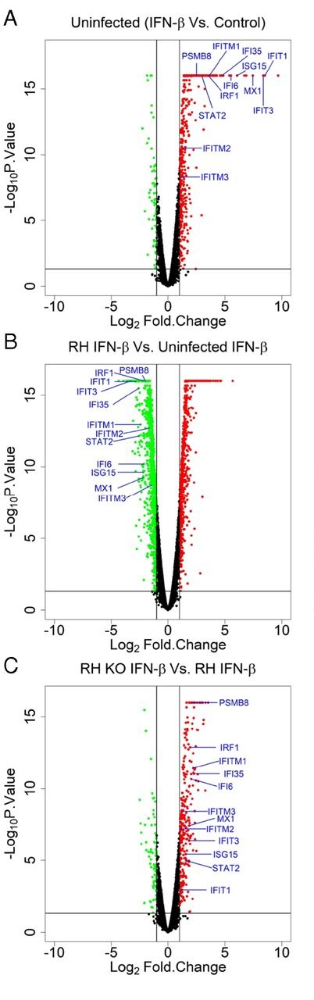
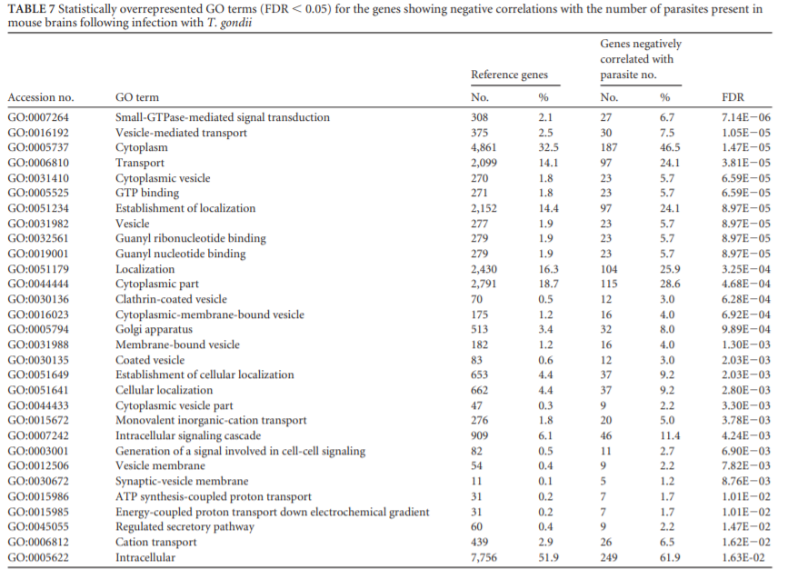

# Introduction to Assignment 3

(Most of this is the exact same as the introduction from Assignment 2, but with
an added section at the end summarizing Assignment 2)

The goal of this project is to determine which genes are differentially-expressed
in human cells infected with the intracellular parasite *Toxoplasma gondii*, and 
to look for any biological patterns in these differentially-expressed genes. To
do this, I am using a gene expression dataset from the 2019 paper 
"*Toxoplasma gondii* effector TgIST blocks type I interferon signaling to promote 
infection" [@matta2019toxoplasma], which can be found 
at [this URL.](https://www.pnas.org/content/116/35/17480) 
In this study, human foreskin fibroblast (HFF) cells were either left uninfected, 
infected with wild-type *T. gondii* (from the RH strain), or infected with knockout *T. gondii*
missing a gene encoding a protein called TgIST that the parasite secretes during host infection.
For each of these 3 infection conditions, the authors additionally treated HFF cells with 
the signaling molecule IFN-B, which is involved in the response of host cells to
infection, or left them untreated. So, there is 1 control condition (uninfected & untreated) and 5 different experimental
conditions (uninfected & IFN-B-treated, wild-type infected & untreated, wild-type
infected & IFN-B-treated, knockout-infected & untreated, and knockout-infected &
IFN-B-treated). RNA-seq data was collected from each of these 6 experimental
conditions in triplicate, for a total of 18 different RNA-seq replicates. This
RNA-seq data is deposited in GEO at accession number
GSE125066, which can be found at [this URL.](https://www.ncbi.nlm.nih.gov/geo/query/acc.cgi?acc=GSE125066)

The authors' major findings with regard to gene expression are shown in the volcano plots
below, which come from Figure 2 of their paper [@matta2019toxoplasma].The genes indicated 
in blue are signaling genes used to activate host defenses against infection. 
This study found that these genes are activated by IFN-B (panel A), but repressed in 
IFN-B-treated cells that are also infected
with wild-type *T. gondii* (panel B), suggesting that *T. gondii* alters host gene expression for its own
benefit. The authors determined that TgIST plays a role in this
host manipulation, as infection with knockout parasites missing this gene still results in
the IFN-B-mediated upregulation of these signaling genes, as seen in uninfected cells
(panel C). 



While the comparisons done in this study all involve IFN-B-treated cells, my 
comparison here will be between untreated cells. So, my control condition is 
uninfected HFF cells untreated with IFN-B, and my experimental condition is 
wild-type *T. gondii*-infected HFF cells untreated with IFN-B.

In Assignment 1, I downloaded the raw gene expression data for these 18 replicates off of GEO, 
filtered out lowly-expressed genes (those without at least 1 Count Per Million
in at least 3 different replicates), and mapped their Ensembl IDs onto HUGO gene symbols.
Doing so reduced my initial dataset of 57,773 genes down to 14,813 genes with
unique HUGO symbols. I then normalized this raw data to log2-Counts Per Million 
(CPM) using Trimmed Mean of M-values (TMM) normalization, to account for technical
variation between samples. Doing so produced a dataframe of log2-CPM normalized
gene expression values with 14,813 rows (one for each gene) and 18 columns (one
for each replicate). Each of these rows is named after a unique HUGO gene symbol.

In Assignment 2, I used limma [@limma] to detect genes that were significantly
differentially-expressed between uninfected, untreated HFF cells and wild-type
infected, untreated HFF cells. Using an adjusted p-value cutoff of 0.05 and a 
magnitude of log fold-change cutoff of 1, I found 3546 differentially expressed
genes. 2101 of these genes were significantly upregulated in infected cells, and
the other 1445 were significantly downregulated in infected cells. I then used
g:Profiler [@reimand2007g] to perform thresholded overrepresentation analysis on
the upregulated and downregulated genes. I found that the upregulated genes were
enriched for genesets involving DNA replication, DNA repair, and the cell cycle, 
while the downregulated genes were enriched for cell adhesion, the extracellular
matrix, and cytoskeletal organization. 

My goal with this assignment is to perform non-thresholded overrepresentation 
analysis on all 14,813 genes using GSEA [@subramanian2005gene], and to visualize
the results in Cytoscape [@shannon2003cytoscape]. Answers to questions given in 
the assignment are distributed throughout the notebook and are indicated in **bold**.


# Initial setup

Before I perform my non-thresholded gene set enrichment analysis, I need to compile
my notebooks from Assignments 1 and 2, so that I can work with the results from
my differential expression analyses. I'm going to compile these notebooks using the
knit_child() function from the knitr package [@knitr], so the code here installs
knitr if it's not installed already.

```{r message=FALSE, warning=FALSE, error=FALSE, results='hide'}
if (!requireNamespace("knitr", quietly = TRUE))
    install.packages("knitr")
```

I then used knitr to compile my notebook from Assignment 2, which in turn compiles
my notebook from Assignment 1 (the actual code to run knitr is hidden to prevent
all the text from Assignment 1 and Assignment 2 from also being shown).
```{r include=FALSE, eval=TRUE}
knitr::knit_child("A2_DanielFusca.Rmd")
```

# Non-thresholded Gene Set Enrichment Analysis

In order to perform non-thresholded gene set enrichment analysis, I need a rank
file that gives the rank for all of my 14,813 genes that have expression data. Ranks are calculated
as the sign of the log-fold change between uninfected and infected cells, times
the -log10 of the adjusted P value for the significance of each gene. Genes with
positive ranks are upregulated in *T. gondii*-infected cells, and genes with
negative ranks are downregulated in *T. gondii*-infected cells. Here's the code
I used to calculate the rank of each of my genes:
```{r}
ranks <- sign(differential_expression_results$logFC) * 
  -log10(differential_expression_results$adj.P.Val)
ranked_gene_list <- data.frame(Gene = rownames(differential_expression_results), 
                               Rank = ranks)
ranked_gene_list <- ranked_gene_list[order(ranked_gene_list$Rank, decreasing = T), ]
```

In Assignment 2, I manually extracted the 10 most significantly upregulated genes
and the 10 most significantly downregulated genes. If I calculated ranks correctly, 
these genes should be at the top and bottom of my ranked list, respectively.
```{r}
# Check the first 10 genes in the ranked gene list
head(ranked_gene_list, 10)

# Check the 10 most significantly upregulated genes
expressionData[most_significant_up_genes, ]

# Check the last 10 genes in the ranked gene list
tail(ranked_gene_list, 10)

# Check the 10 most significantly downregulated genes
expressionData[most_significant_down_genes, ]
```

The first 10 genes and the last 10 genes in my ranked list match the 10 most significantly
overexpressed and 10 most significantly underexpressed genes from my differential 
expression results, so it looks like I made this ranked list accurately.

This rank file contains ranks for all 14,813 genes that had unique HUGO IDs and 
that passed my expression filters:
```{r}
nrow(ranked_gene_list)
```

I then wrote this ranked gene list to a text file for use with GSEA:
```{r}
write.table(ranked_gene_list, file = "ranked_gene_list.rnk", row.names = F, 
            col.names = T, quote = F, sep = "\t")
```

**Along with my ranked gene file, I also need a GMT file that defines sets of human
genes. For my GMT file, I used [this dataset from the Bader lab.](http://download.baderlab.org/EM_Genesets/March_01_2020/Human/symbol/Human_GOBP_AllPathways_no_GO_iea_March_01_2020_symbol.gmt)
This GMT file contains genesets for pathway and Gene Ontology Biological Process
data, excluding GO IEA genesets (those that were determined electronically and 
not manually curated). This dataset is from the Bader lab's March 1, 2020 release and
contains a total of 18,405 different gene sets.**

**I then performed non-thresholded gene set enrichment analysis by running 
GSEA version 4.0.3 [@subramanian2005gene] from its GUI, using the Bader lab GMT as the gene set database
and the ranked gene list created above as the ranked list. GSEA preranked
analysis was run with 1000 permutations, using a maximum gene set size of 500
and a minimum gene set size of 15. I set "Collapse/Remap to gene symbols" to 
"No_collapse", since this ranked list already contains the symbol
for each gene. All other parameters were left as default.**

After filtering genesets based on size, only 5574 genesets were left. Of these 
5574 genesets, **589 were enriched among upregulated genes with a corrected 
False Discovery Rate (FDR) <= 0.05, and 246 were enriched among downregulated
genes with an FDR <= 0.05**.

Here are the 20 genesets with the highest positive Normalized Enrichment Scores (NES) that
are enriched among genes that are upregulated in *T. gondii*-infected cells:


**Overall, these upregulated terms are generally associated with DNA replication
and control of the cell cycle.**

Here are the 20 genesets with the lowest negative NES that are enriched among genes that
are downregulated in *T. gondii*-infected cells:


**Overall, these downregulated terms are generally associated with vesicle formation
and intracellular transport, along with some terms relating to the cytoskeleton
and the extracellular matrix.**

The geneset with the highest positive NES that was enriched among upregulated genes in
infected cells was "HALLMARK_E2F_TARGETS". According to the [MSigDB page for this geneset](https://www.gsea-msigdb.org/gsea/msigdb/geneset_page.jsp?geneSetName=HALLMARK_E2F_TARGETS&keywords=E2F), 
this set contains "Genes encoding cell cycle related targets of E2F transcription factors".
This geneset contains 121 genes from my ranked list in its leading edge, including
MCM4, which is at the very top of my ranked list.

The geneset with the lowest negative NES that was enriched among downregulated genes in
infected cells was "VESICLE ORGANIZATION". According to the [Gene Ontology page for this geneset](http://amigo.geneontology.org/amigo/term/GO:0016050), 
this function is defined as "a process that is carried out at the cellular level
which results in the assembly, arrangement of constituent parts, or disassembly of a vesicle".
This geneset contains 134 genes from my ranked list in its leading edge.


**The upregulated terms identified here are pretty much the same as the terms enriched
among upregulated genes identified in Assignment 2. Like I saw with g:Profiler, most
of the most significant genesets involve the cell cycle and DNA replication, although I
didn't see terms for DNA repair like I did in Assignment 2. In contrast, there are some major differences for the downregulated terms. In
Assignment 2, I found that most of the genesets enriched for downregulated genes
had to do with cell adhesion, the extracellular matrix, and cytoskeletal organization, 
but most of the downregulated terms identified by GSEA have to do with
vesicle transport and organization. The GSEA results still contain a small number
of genesets associated with the extracellular matrix and the cytoskeleton, but
the dominant themes identified here are definitely about vesicle transport, which
I didn't identify at all in Assignment 2.**

**However, it's hard to make a 100% fair comparison between the results from GSEA and the results
from g:Profiler. For one, I used different GMT files in these 2 analyses to define 
my genesets: for GSEA I used the GO BP and pathway GMT from the Bader lab, but
for g:Profiler I just used the provided GMTs they had for GO BP, Reactome, and WikiPathways
genesets. So, the genesets that my g:Profiler and GSEA analyses are drawing from
are at least slightly different, meaning terms may appear to be enriched in one
analysis and not the other because the geneset is only found in one of the GMTs. 
Additionally, for my GSEA analyses I applied a size threshold to my genesets by only
using those with between 15 and 500 genes, whereas almost all of my g:Profiler analyses
had no restriction on geneset size, further leading to potential differences between
the genesets used in these approaches.**


# Enrichment Analysis in Cytoscape

To get a more in-depth look at my GSEA results, I visualized these results in
Cytoscape version 3.7.1 [@shannon2003cytoscape] using the EnrichmentMap clustering
and annotation pipeline [@reimand2019pathway].

To start, I used Cytoscape to download all the apps for the entire EnrichmentMap
pipeline. I then loaded in my GSEA results into Cytoscape by going to Apps -> 
EnrichmentMap -> Create Enrichment Map, and then selecting the directory containing
my results from GSEA. I left the autopopulated name fields as the defaults determined by EnrichmentMap:

  * Analysis Type = GSEA
  * Enrichments Pos = "gsea_report_for_na_pos_1585178090230.xls"
  * Enrichments Neg = "gsea_report_for_na_neg_1585178090230.xls"
  * GMT = "Human_GOBP_AllPathways_no_GO_iea_March_01_2020_symbol.gmt"
  * Ranks = "ranked_gene_list_na_pos_versus_na_neg_1585178090230.xls"
  * Positive phenotype = na_pos
  * Negative phenotype = na_neg

**To create the network from these GSEA results, I set the FDR q-value cutoff to
0.05. All other parameters were left as default: "Data Set Edges" was left as 
"Automatic", and "Connectivity" was left halfway between "dense" and "sparse".**

**The resulting network contains 830 nodes and 7272 edges. 586 nodes have a positive 
NES (genesets enriched among upregulated genes in infected cells - these are the
red nodes in the network), and 244 nodes have a negative NES (genesets enriched among
downregulated genes in infected cells - these are the blue nodes in the network).**
These node numbers are slightly different from the genesets in my GSEA results 
that had an FDR q-value <= 0.05 (589 upregulated and 246 downregulated) due to 
rounding differences between the GSEA output and EnrichmentMap. 

**Here's what the entire network looks like before any manual editing:**


Here's a screenshot of a subsection of the unedited network that contains 
HALLMARK_E2F_TARGETS (highlighted in yellow here), the geneset with the highest
positive NES from the GSEA analysis:


Here's a screenshot of a subsection of the unedited network that contains 
VESICLE_ORGANIZATION (highlighted in yellow here), the geneset with the lowest
negative NES from the GSEA analysis:


I then grouped my network into annotated clusters using the AutoAnnotate app in
Cytoscape, by going to Apps -> AutoAnnotate -> New Annotation Set. **I ran AutoAnnotate on
my network using the following parameters:**

  * **"Annotate entire network" was selected**
  * **"Layout network to prevent cluster overlap" was NOT selected**
  * **"Label column" was set to "GS_DESCR"**
  * **Cluster were made with "Use clusterMaker App", with the algorithm set as 
  "MCL Cluster" and the edge weight column set as "similarity_coefficient"**
  * **"Create singleton clusters" was NOT selected**
  * **Labelling was done with WordCloud's Adjacent Words algorithm, using 3 words 
  per label and an adjacent word bonus of 8**
  
The resulting annotation network now has 103 clusters and 84 singleton nodes. 
The clusters range in size from 2 nodes to 66 nodes. 
  
Here's what the network looks like without any further manual editing beyond
making the annotations:


The 5 largest clusters that contain upregulated terms (nodes in the cluster mostly have positive NES) are:

  * Sumoylation export nucleus (66 genesets) 
  * Expression nucleosome assembly (64 genesets) 
  * Glycolytic processs 6 (60 genesets) (the "6" appears to refer to glucose-6-phosphate
  and fructose-6-phosphate)
  * Homologous strand repair (58 genesets)
  * Replicative checkpoints initiation (25 genesets)
  
The 5 largest clusters that contain downregulated terms (nodes in the cluster mostly have negative NES) are:

  * Endosome multivesicular cytokinesis (17 genesets)
  * Cargo loading vesicle (16 genesets)
  * Polymerization actin filament (15 genesets)
  * Phagocytosis engulfment invagination (11 genesets)
  * Retrograde Golgi traffic (10 genesets)
  
In order to actually interpret this annotated and clustered network, I manually
edited it to look more publication-ready. I separated out all of the clusters so
that all of the labels on each cluster were fully visible. I put all of the clusters
containing predominantly red (upregulated) genesets on the left side of the network,
and all of the clusters containing predominantly blue (downregulated genesets)
ont the right. To make the differences in significance between genesets more clear, 
I used continuous mapping to map the NES of each geneset onto its color. Genesets
with more positive NES are more red, and genesets with more negative NES are more blue. 
The default style had an image on each node such that all of the upregulated nodes
were the same shade of red, and all the downregulated nodes were the same
shade of blue. I removed this image so that my new color scheme was visible on
each node. I also turned off labels on the individual nodes, since there's way too
many nodes clustered together for all of the node labels to be legible. I kept
the default mappings for node size (larger nodes are genesets with more genes) and
edge size (thicker edges have more overlap between genesets).
To make this network easier to interpret, I added a legend to show the meaning 
behind node size, node color, and edge size in this network. This legend is 
based off of [the legend provided by the Bader lab for use with EnrichmentMap.](http://baderlab.org/Software/EnrichmentMap#Legends)
  
**Here's what my final clustered, annotated, and manually edited network of enriched
genesets looks like:**


(The circles in the legend for node size don't match the actual sizes of the nodes
in the network, since otherwise this legend would be too small to interpret easily)

Interestingly, 2 unclustered singleton nodes are highly connected to some of these
clusters created by AutoAnnotate. These are the 2 blue nodes on the right connecting
"endosome multivesicular cytokinesis", "cargo loading vesicle", and "retrograde 
golgi traffic". The singleton on the left is the "vesicle organization" geneset
that has the lowest NES in the network (NES = -2.5445), and the singleton on the
right is the "Golgi vesicle transport" geneset that has the 3rd-lowest NES in the
network (NES = -2.455).
 
I then further simplified this network into a theme network, by collapsing each
cluster into a single node. To do this I went to the AutoAnnotate panel and clicked
on Create Summary Network -> Clusters and Unclustered Nodes. After collpasing these
clusters I further cleaned up the resulting network by increasing label font size, and
setting label position so that labels are directly above nodes instead of over the center of nodes.
I also hid labels for all of the collapsed singleton nodes along the bottom of the
network (those that only contained 1 geneset before collapsing), using a bypass label
size of 1 and a bypass label color set to white. Like my previous network, I added
in a legend describing the mapping between node color and NES (more red nodes have a more
positive average NES between all genesets in the cluster, and more blue nodes have a more
negative average NES between all genesets in the cluster). Finally, I moved nodes around so
that all of the node labels were fully visible. 
  
**Here's what the collapsed theme network looks like:**


The resulting theme network has 187 nodes and 89 edges. Of these 187 nodes, 84 are
from unclustered singletons, and the remaining 103 are from clusters generated by
AutoAnnotate.

**The major themes among upregulated genes involve the cell cycle (e.g. "g1 transition mitotic"), 
DNA replication ("e.g. replicative checkpoints initiation"), DNA repair (e.g. 
"homologous strand repair"), and carbohydrate metabolism (e.g. "glycolytic process 6").**

**The major themes among downregulated genes involve vesicle organization and 
transportation (e.g. "cargo loading vesicle", "Golgi vesicle transport"), and 
cytoskeletal organization (e.g. "polymerization actin filament").**

**I can't really say if these themes fit with the model given in the original paper
[@matta2019toxoplasma], since that paper didn't really compare uninfected, untreated
cells to wild-type *T. gondii*-infected, untreated cells like I did here - most of their comparisons
involved cells treated with IFN-B, or cells infected with mutant *T. gondii* carrying
a TgIST knockout (see the Interpretation section for further discussion about
this). I can say that there are some novel pathways and themes that I didn't pick
up using g:Profiler or with my initial look at my GSEA results. For my upregulated
genes, the novel themes are glycolysis and protein sumoylation - these are some of the
clusters that contain the most genesets, but I didn't see them at all in my 
previous analyses. I also see a recurring theme of DNA repair that I didn't see in my
initial GSEA results (DNA repair was a major theme in my g:Profiler results). 
There are also a couple of novel upregulated clusters involved with
the immune system, such as "leukocyte proliferation lymphocyte" and "12 stimulation interleukin". 
For the downregulated genes, the major themes identified in the theme network are 
all of the same themes I saw in my top GSEA results (although these are still 
fairly different from what I saw with g:Profiler), namely vesicle-mediated 
transport and (less significantly) cytoskeletal organization.**

# Interpretation

**1. Do the enrichment results support conclusions or mechanisms discussed in the 
original paper? How do these results differ from the results you got from 
Assignment #2 thresholded methods?**

As I discussed in Assignment 2, it's hard to compare my results here to the findings
in the original paper [@matta2019toxoplasma]. In the original paper, the authors
primarily did comparisons between experimental treatments where the human cells were 
treated with IFN-B, or the *T. gondii* contained a TgIST knockout. My comparisons
here are between uninfected cells not treated with IFN-B and cells infected with 
wild-type *T. gondii* and not treated with IFN-B, so the original paper didn't really
compare the treatment groups that I'm comparing here. However, one of the main 
findings of that original paper is that infection with *T. gondii* can suppress the
host's defensive response, and downregulate the expression of genes involved with
immune system signalling. Similar to Assignment 2, none of the most significant
terms represented in upregulated genes are involved with immune system signalling, 
so it's possible that the general absence of upregulated immune system genes might 
be due to host gene expression modulation by *T. gondii*, as proposed in the original
paper. Interestingly, and unlike what I saw in Assignment 2, I actually did find a modest
recurring theme of the immune system upregulation in my enrichment map. There are
clusters full of upregulated genesets annotated as "leukocyte proliferation lymphocyte", 
"immunity built superfamily", "12 stimulation interleukin", and "7 mediated interleukin". 
The genesets in these clusters are not among those with the highest NES, but they're 
still present. So, it may be the case that some aspects of the host defense system
still are upregulated in response to *T. gondii* infection. I don't think this result
conflicts with the findings of the original paper that much - that study reported
the effects of *T. gondii* on a specific immune signalling pathway (interferon signalling), 
but none of the upregulated genesets I found here seem to have interferon annotations, 
so it may be the case that *T. gondii* downregulates host signalling in some immune
pathways (as reported in the original paper) but not others.

Compared to Assignment 2, my findings for the significantly upregulated genes 
are generally the same using non-thresholded methods. My GSEA results and my
enrichment map show that many upregulated genes are involved with DNA replication, DNA
repair, and the cell cycle, which is consistent with what I found in Assignment 2. 
However, I did find some upregulated themes that I didn't see in Assignment 2. My
enrichment map here shows many upregulated genesets that are involved with glycolysis
and protein sumoylation (see the "glycolytic process 6" and "sumoylation export
nucleus" clusters) - these are some of the largest clusters on my enrichment map, but
I didn't really see these genesets in my g:Profiler analyses. As noted above, I also
found some weaker upregulation of immune-related genesets that I didn't see in 
Assignment 2. These all might have been present in my g:Profiler analyses from
Assignment 2, but if they were, they weren't significant enough for me to detect
by looking at the top returned genesets. In contrast, my findings for the 
significantly downregulated genes are a lot more different compared to Assignment 2.
In Assignment 2, the dominant themes among downregulated genes involved cell
adhesion, the extracellular matrix, and cytoskeleton organization. My GSEA
and EnrichmentMap analyses, however, found that the dominant terms had to do
with vesicle organization and intracellular transport. Cytoskeletal organization
was still significantly downregulated, but the dominant themes had to do with
vesicles, which I didn't see at all in Assignment 2. Again, these terms might have
been present in my g:Profiler analyses, but they probably weren't significant 
enough for me to pick out.


**2. Can you find evidence, i.e. publications, to support some of the results 
that you see? How does this evidence support your result?**

Similar to my thresholded overrepresentation analysis from Assignment 2, I found
that upregulated genes in infected cells were enriched for genesets involving
DNA replication, DNA repair, and the cell cycle. Like I talked about in Assignment 2, 
a study that infected human retinal epithelial cells with *T. gondii* [@smith2019immunological]
found that the most significant Reactome genesets among differentially-expressed 
genes in the host involved DNA replication and the cell cycle, which is consistent
with what I found here and in Assignment 2. One of the things I found here but not
in Assignment 2 is an enrichment of genesets involved with glycolysis among upregulated
genes - one of the largest clusters of upregulated genesets in my enrichment map is
annotated as "glycolytic process 6". I looked for papers that also profiled gene
expression in *T. gondii*-infected cells, and I found a paper that did microarray analyses
on the same cell type I'm studying here (human foreskin fibroblasts) [@blader2001microarray]. 
The authors found that of the 11 glycolysis pathway enzymes that they examined, 7 were 
significantly upregulated in infected cells. So, both this study and my work here
show that many genes involved with glycolysis are significantly upregulated in 
HFF cells infected with *T. gondii*. 

I also looked for papers that had similar results to what I found here for
downregulated genes. I found a paper that looked at gene expression in mouse brain
tissue infected with *T. gondii* [@tanaka2013transcriptome], and found some support
for one of my observations. The authors of this paper compared gene expression in
infected mouse brains to the number of parasites causing the infection, and identified 473 genes
where gene expression was negatively correlated with parasite number. The GO terms
they found to be significantly enriched among these negatively-correlated genes
are shown in the table below, which is Table 7 from their paper [@tanaka2013transcriptome].



A number of the most significantly-enriched GO terms involve vesicle formation
and transport, such as "vesicle-mediated transport" and "clathrin-coated vesicle". 
This is similar to what I found - the downregulated genes in my HFF dataset were
significantly enriched for terms involving vesicle organization and transport, as
shown in my GSEA and EnrichmentMap results. This paper used a different approach to
the one I used for my analyses - instead of comparing uninfected cells to infected
cells to find downregulated genes like I did, the authors looked for genes that showed
a negative correlation between expression and parasite number. Regardless, both of
these approaches return genes whose expression is likely downregulated due to 
*T. gondii* infection, and this study supports my findings that many of these downregulated
genes are involved in vesicle-mediated transport.


**3. Choose a specific pathway or theme to investigate in more detail. Why did 
you choose this pathway or theme? Show the pathway or theme as a gene network or 
as a pathway diagram. Annotate the network or pathway with your original log fold
expression values and p-values to show how it is effected in your model.**

Based on my GSEA results and my EnrichmentMap networks, it looks like there are 
a lot of upregulated genes involved in DNA replication - my genesets from GSEA
with the highest positive NES include things like "CELL CYCLE DNA REPLICATION", 
"NUCLEAR DNA REPLICATION", and "DNA REPLICATION", and my annotated network contains
a big cluster of upregulated genes annotated as "replicative checkpoints initiation". 
So, there's probably something biologically interesting happening in this pathway 
upon *T. gondii* infection. I'm interested in looking at the full DNA replication pathway in more detail, to see which
specific parts of the pathway tend to be upregulated, along with what proportion of the entire 
pathway seems to be upregulated. 

To do this, I loaded the DNA replication pathway into Cytoscape using 
WikiPathways [@slenter2018wikipathways]. I installed the WikiPathways app in 
Cytoscape, and then imported the pathway by going to File -> Import -> Network
from Public Databases. From there, I set the Data Source to WikiPathways, selected
the DNA Replication pathway for *Homo sapiens* (the pathway with ID WP466), and then
Imported as Pathway.

Here's what the pathway looks like right after I import it:


This network shows the DNA replication pathway as a series of steps, with arrows 
indicating the flow between different reactions and protein complexes. In total
there are 42 different nodes that correspond to genes (the white rectangles with
black text). 

I'm interested in the log fold-changes of all of these genes between uninfected 
and infected HFF cells. So, I annotated this pathway with my log fold-changes
from Assignment 1, along with the rank values I calculated here. The rank of a 
gene is the sign of its log fold-change times the -log10 of its adjusted p-value,
so this rank information gives the significance of these fold-changes.

I already have a file giving the rank of each gene, so I used to code here to
write a file containing all of my genes, along with their log fold-change values:
```{r}
# Write gene names and log fold-changes to a text file
write.table(cbind(rownames(differential_expression_results), differential_expression_results[, 1]), 
            file = "differential_expression_results.txt", quote = F, sep = "\t", 
            col.names = c("Gene", "logFC"), row.names = F)
```

I then loaded my log fold-change and rank files into Cytoscape by going to File ->
Import -> Table from File, selecting the file, setting "Where to Import Table Data"
to "To selected network only" and selecting my imported WikiPathways network. I
left the key column for the network as "shared name". 
  
After loading in my log fold-change and rank information, I set the fill color of each
node to continuously map onto its log-fold change (more red nodes have a more positive
log fold-change, and more blue nodes have a more negative log fold-change), and the 
color of each node's border to continuously map onto its rank (nodes with more red borders
have a more positive rank, and nodes with more blue borders have a more negative rank).
I also increased the width of every node's border, 
so that this rank information is more visible. I added in a legend showing what
these node colors and border colors mean.

Here's what the pathway looks like now that I've annotated it with my log-fold change
and rank information:


I only have expression data for 31 of these 42 genes, but I can still make some
observations. Almost all of these genes are upregulated in infected cells - only
2 genes here have a negative log fold-change. It looks like the strongest upregulation
in this pathway has to do with the assembly of the pre-replicative complex (step
1 here). Aside from MCM6, all of the proteins that make up the Orc complex (Cdc6, 
Cdt1, and the MCM proteins) are strongly upregulated in infected cells. In fact, 
one of them (MCM4) is at the very top of my ranked list. The actual 
DNA replication steps (leading lagging/strand synthesis, which is step 5 here) also
tend to be upregulated, although not as strongly as the genes at the beginning of
the pathway. Interestingly, of the 4 DNA polymerase delta proteins here (POLD1, 
POLD2, POLD3, and POLD4), 3 are significantly upregulated, but one is significantly 
downregulated. I'm not sure of the exact function of all of these proteins, but
it seems like most proteins involved in DNA replication are upregulated in cells
infected with *T. gondii*, especially those that initiate the process. 

# References
