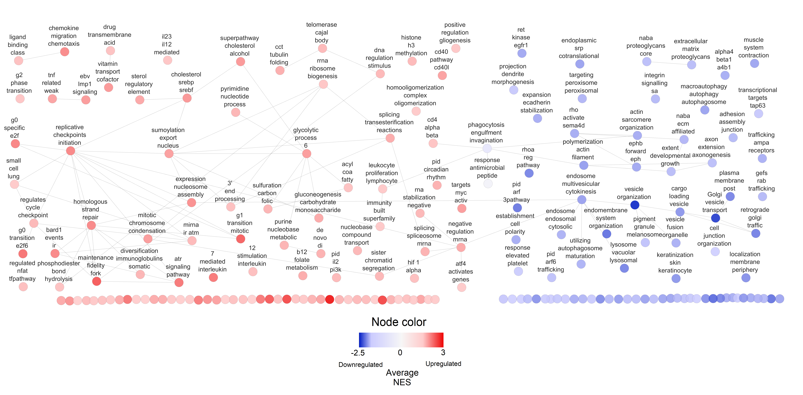
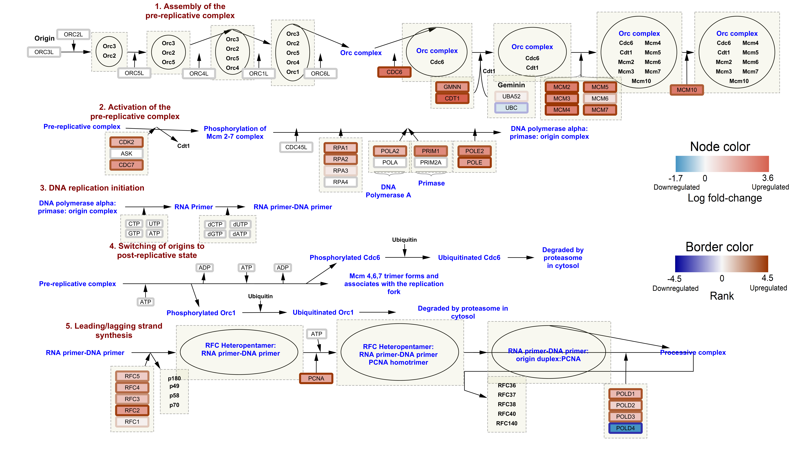

# About this notebook


-UPLOAD NEW FIGURES AND NEW CITATION FILE TO GITHUB

# Introduction to Assignment 3


# Initial setup

MAKE SURE KNITR IS INSTALLED [@knitr]
```{r message=FALSE, warning=FALSE, error=FALSE, results='hide'}
if (!requireNamespace("knitr", quietly = TRUE))
    install.packages("knitr")
```

KNIT ASSIGNMENTS 1 AND 2

```{r include=FALSE, eval=TRUE}
knitr::knit_child("A2_DanielFusca.Rmd")
```


# Non-thresholded Gene Set Enrichment Analysis

Create a rank file for all 14,813 genes with expression data. Ranks are calculated
as the sign of the log-fold change between uninfected and infected cells, times
the -log10 of the adjusted P value for the significance of each gene. Genes with
positive ranks are upregulated in *T. gondii*-infected cells, and genes with
negative ranks are downregulated in *T. gondii*-infected cells.
```{r}
ranks <- sign(differential_expression_results$logFC) * 
  -log10(differential_expression_results$adj.P.Val)
ranked_gene_list <- data.frame(Gene = rownames(differential_expression_results), 
                               Rank = ranks)
ranked_gene_list <- ranked_gene_list[order(ranked_gene_list$Rank, decreasing = T), ]
```

Check that my ranked list matches the top 10 upregulated genes and the top 10 
downregulated genes that I calculated before:
```{r}
# Check the first 10 genes in the ranked gene list
head(ranked_gene_list, 10)
expressionData[most_significant_up_genes, ]

# Check the last 10 genes in the ranked gene list
tail(ranked_gene_list, 10)
expressionData[most_significant_down_genes, ]
```

The first 10 genes and the last 10 genes in my ranked list match the 10 most significantly
overexpressed and 10 most significantly underexpressed genes from my differential 
expression results, so it looks like I made this ranked list accurately.

This rank file contains ranks for all 14,813 genes that had unique HUGO IDs and 
that passed my expression filters:
```{r}
nrow(ranked_gene_list)
```


Write ranked gene list to a text file for use with GSEA:
```{r}
write.table(ranked_gene_list, file = "ranked_gene_list.rnk", row.names = F, 
            col.names = T, quote = F, sep = "\t")
```


GMT file of human gene sets from [this dataset from the Bader lab.](http://download.baderlab.org/EM_Genesets/March_01_2020/Human/symbol/Human_GOBP_AllPathways_no_GO_iea_March_01_2020_symbol.gmt)
This GMT file contains genesets for pathway and Gene Ontology Biological Process
data, excluding GO IEA genesets (those that were determined electronically and 
not manually curated). This dataset is from the Bader lab's March 1, 2020 release and
contains a total of 18,405 different gene sets.

Run GSEA version 4.0.3 [@subramanian2005gene] using the Bader lab GMT as the gene set database
and the ranked gene list created above as the ranked list. GSEA preranked
analsis was run with 1000 permutations, using a maximum gene set size of 500
and a minimum gene set size of 15. I set "Collapse/Remap to gene symbols" to 
"No_collapse", since this ranked list already contains the symbol
for each gene. All other parameters were left as default.


After filtering genesets based on size, only 5574 genesets were left. Of these 
5574 genesets, **589 were enriched among upregulated genes with a corrected 
False Discovery Rate (FDR) <= 0.05, and 246 were enriched among downregulated
genes with an FDR <= 0.05**.

Here are the 20 genesets with the highest Normalized Enrichment Scores (NES) that
are enriched among genes that are upregulated in *T. gondii*-infected cells:


Overall, these upregulated terms are generally associated with DNA replication
and control of the cell cycle.

Here are the 20 genesets with the lowest NES that are enriched among genes that
are downregulated in *T. gondii*-infected cells:


Overall, these downregulated terms are generally associated with vesicle formation
and intracellular transport, along with some terms relating to the cytoskeleton
and the extracellular matrix.

The geneset with the highest NES that was enriched among upregulated genes in
infected cells was "HALLMARK_E2F_TARGETS". According to the [MSigDB page for
this geneset](https://www.gsea-msigdb.org/gsea/msigdb/geneset_page.jsp?geneSetName=HALLMARK_E2F_TARGETS&keywords=E2F), 
this set contains "Genes encoding cell cycle related targets of E2F transcription factors".
This geneset contains 121 genes from my ranked list in its leading edge, including
MCM4, which is at the very top of my ranked list.


The geneset with the lowest NES that was enriched among downregulated genes in
infected cells was "VESICLE ORGANIZATION". According to the [Gene Ontology page for this geneset](http://amigo.geneontology.org/amigo/term/GO:0016050), 
this function is defined as "a process that is carried out at the cellular level
which results in the assembly, arrangement of constituent parts, or disassembly of a vesicle".
This geneset contains 134 genes from my ranked list in its leading edge.


FINISH ANSWERING QUESTIONS FROM THE ASSIGNMENT


-Hard to make 100% fair comparisons since this analysis and the g:Profiler analysis
used different gene set GMTs and different thresholds on gene set size (gene sets
here were limited to those with 15-200 genes, while almost all of my g:Profiler
analyses had no gene set size limitations at all)


# Enrichment Analysis in Cytoscape

EXPLAIN THE PARAMETERS YOU USED FOR:
-CYTOSCAPE [@shannon2003cytoscape]
-ENRICHMENTMAP PIPELINE [@reimand2019pathway]

Cytoscape -> Apps -> EnrichmentMap -> Create Enrichment Map
Selected the directory of my GSEA results created in the previous section
Left the autopopulated name fields as the defaults determined by EnrichmentMap:
  -Analysis Type = GSEA
  -Enrichments Pos = "gsea_report_for_na_pos_1585178090230.xls"
  -Enrichments Neg = "gsea_report_for_na_neg_1585178090230.xls"
  -GMT = "Human_GOBP_AllPathways_no_GO_iea_March_01_2020_symbol.gmt"
  -Ranks = "ranked_gene_list_na_pos_versus_na_neg_1585178090230.xls"
  -Positive phenotype = na_pos
  -Negative phenotype = na_neg
  
For the Expressions field, I supplied the file of log-CPM normalized gene expression
values I created in Assignment 1 (logCPMNormalizedExpressionData.txt). 

To create the network from these GSEA results, I set the FDR q-value cutoff to
0.05. All other parameters were left as default: "Data Set Edges" was left as 
"Automatic", and "Connectivity" was left halfway between "dense" and "sparse"


Resulting network contains 830 nodes and 7272 edges. 586 nodes have a positive 
NES (genesets enriched among upregulated genes in infected cells - these are the
red nodes in the network), and 244 nodes have a negative NES (genesets enriched among
downregulated genes in infected cells - these are the blue nodes in the network). 
These node numbers are slightly different from the genesets in my GSEA results 
that had an FDR q-value <= 0.05 (589 upregulated and 246 downregulated) due to 
rounding differences between the GSEA output and EnrichmentMap. 


Here's what the entire network looks like before any manual editing:


Here's a screenshot of a subsection of the unedited network that contains 
HALLMARK_E2F_TARGETS (highlighted in yellow here), the geneset with the highest
positive NES from the GSEA analysis:


Here's a screenshot of a subsection of the unedited network that contains 
VESICLE_ORGANIZATION (highlighted in yellow here), the geneset with the lowest
negative NES from the GSEA analysis:


I then grouped my network into annotated clusters using the AutoAnnotate app in
Cytoscape. (Apps -> AutoAnnotate -> New Annotation Set). I ran AutoAnnotate on
my network using the following parameters:
  -"Annotate entire network" was selected
  -"Layout network to prevent cluster overlap" was NOT selected
  -"Label column" was set to "GS_DESCR"
  -Cluster were made with "Use clusterMaker App", with the algorithm set as 
  "MCL Cluster" and the edge weight column set as "similarity_coefficient"
  -"Create singleton clusters" was NOT selected
  -Labelling was done with WordCloud's Adjacent Words algorithm, using 3 words 
  per label and an adjacent word bonus of 8
  
The resulting annotation network now has 103 clusters and 84 singleton nodes. 
The clusters range in size from 2 nodes to 66 nodes. 
  
Here's what the network looks like without any further manual editing beyond
making the annotations:


The 5 largest clusters that contain upregulated terms (nodes mostly have positive NES) are:

  * Sumoylation export nucleus (66 genesets) 
  * Expression nucleosome assembly (64 genesets) 
  * Glycolytic processs 6 (60 genesets) (the "6" appears to refer to glucose-6-phosphate
  and fructose-6-phosphate)
  * Homologous strand repair (58 genesets)
  * Replicative checkpoints initiation (25 genesets)
  
The 5 largest clusters that contain downregulated terms (nodes mostly have negative NES) are:

  * Endosome multivesicular cytokinesis (17 genesets)
  * Cargo loading vesicle (16 genesets)
  * Polymerization actin filament (15 genesets)
  * Phagocytosis engulfment invagination (11 genesets)
  * Retrograde Golgi traffic (10 genesets)
  
  
LAYOUT NETWORK TO LOOK NICE:
  -RED NODES ON THE LEFT, BLUE NODES ON THE RIGHT
  -SEPARATE OUT THE CLUSTERS AND MAKE SURE ALL THE LABELS ARE VISIBLE
  -TURN OFF NODE LABELS
  -MAP NODE COLOR ONTO NES - I used a continuous mapping on the NES of each node. 
  I set the 
  -The default style had an image on each node such that all of the upregulated
  nodes were the same shade of red, and all the downregulated nodes were the same
  shade of blue. I removed this image so that my new color scheme was visible on
  each node.
  
  


Interestingly, 2 unclustered singleton nodes are highly connected to some of these
clusters created by AutoAnnotate. These are the 2 blue nodes on the right connecting
"endosome multivesicular cytokinesis", "cargo loading vesicle", and "retrograde 
golgi traffic". The singleton on the left is the "vesicle organization" geneset
that has the lowest NES in the network (NES = -2.5445), and the singleton on the
right is the "Golgi vesicle transport" geneset that has the 3rd-lowest NES in the
network (NES = -2.455).
 
  -ADD ON LEGEND FROM BADER LAB
  
  
SIMPLIFY NETWORK INTO THEMES:
  -AutoAnnotate panel -> Create Summary Network -> Clusters and Unclustered Nodes
  -Increase label font size, set label position so that labels are directly above
  node instead of over the center of node
  -Removed labels for all of the collapsed singleton nodes along the bottom by
  using a bypass label size of 1 and a bypass label color set to white
  -Moved some nodes so that all of the labels were fully visible
  
  
ACTUALLY PUT IN PICTURE OF THIS ^^^ NETWORK



The resulting theme network has 187 nodes and 89 edges. Of these 187 nodes, 84 are
from unclustered singletons, and the remaining 103 are from clusters generated by
AutoAnnotate.


PICK A REACTOME PATHWAY AND LOOK AT IT IN MORE DETAIL
  -WRITE LOG-FOLD CHANGES FOR EACH GENE ALONG WITH GENE NAME TO A 
  FILE -> LOAD INTO NEW CYTOSCAPE NETWORK
```{r}
write.table(cbind(rownames(differential_expression_results), differential_expression_results[, 1]), 
            file = "differential_expression_results.txt", quote = F, sep = "\t", 
            col.names = c("Gene", "logFC"), row.names = F)
```

  -Install WikiPathways app in CytoScape
  -File -> Import -> Network from Public Databases
  -Set Data Source to WikiPathways, then selecte "DNA Replication" for Homo
  sapiens (the pathway with ID WP466), then Import as Pathway
  
Here's what the pathway looks like before I import my log-fold changes and p-values:


In total there are 42 different nodes that correspond to genes. 

Load in log-fold changes and ranks (ranks are the sign of the log-fold change
times the -log10 adjusted p-value):
  -File -> Import -> Table from File, select the file of log-fold changes
  -Set "Where to Import Table Data" to "To selected network only", then select
  my imported WikiPathways network
  -Left the key column for the network as "shared name", and the key for the table 
  as the gene name for each gene
  -Repeat to import the file of gene ranks
  
Set the color of each node to continuously map onto its log-fold change, and set
the color of each node's border to continuosly map onto its rank. I also increased
the width of every node's border, so that the rank information is more visible. 

Here's what the pathway looks like now that I've annotated it with my log-fold change
and rank information:


DISCUSS WHAT THIS ACTUALLY MEANS

ADD IN LEGENDS TO ALL OF YOUR "GOOD" FIGURES


# Interpretation

**1. Do the enrichment results support conclusions or mechanism discussed in the 
original paper? How do these results differ from the results you got from 
Assignment #2 thresholded methods **

**2. Can you find evidence, i.e. publications, to support some of the results 
that you see. How does this evidence support your result?**

Tanaka et al. mouse paper: "host genes whose expression was diminished by infection with the parasites were those
involved in small-GTPase-mediated signal transduction and vesiclemediated 
transport" - Table 7 (WHAT DO THEY MEAN BY "NEGATIVE CORRELATION"?)

**3. Choose a specific pathway or theme to investigate in more detail. Why did 
you choose this pathway or theme? Show the pathway or theme as a gene network or 
as a pathway diagram. Annotate the network or pathway with your original log fold
expression values and p-values to show how it is effected in your model.**


# References
